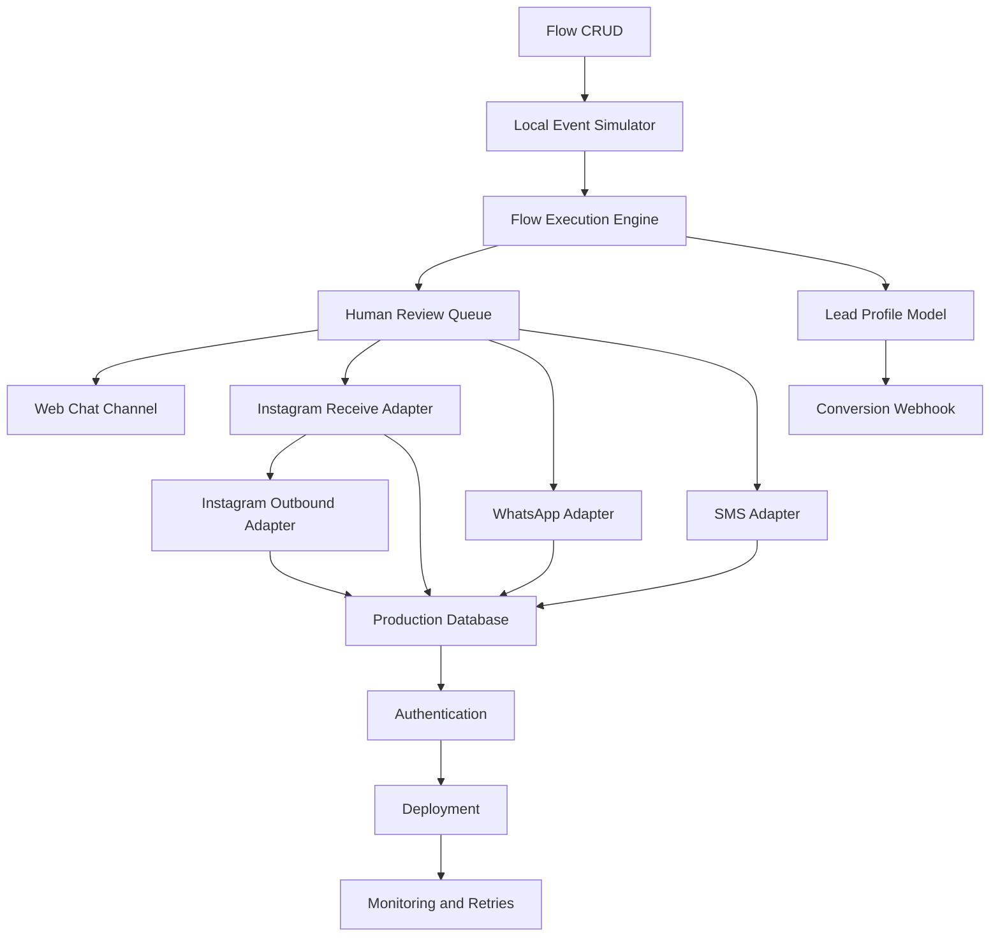

# Message Manager Not-Yet-Built Roadmap

Created: 2026-06-30

This document lists the remaining Message Manager system pieces and orders them by how little additional information is needed to build the next useful step. The purpose is to make each build session easy to start: ask Mark for the needed inputs, build that slice, verify it, then move to the next slice.

## Current Baseline

Message Manager is currently a local API-backed prototype.

Built:
- Static Message Manager UI connected to a local Node API.
- JSON persistence in `data/omniflow-state.json`.
- Flow catalog, trigger registration, conversations, content requests, conversions, and SMM export endpoints.
- SMM Dashboard import/export bridge.
- SMM Dashboard display of Message Manager inbox, content request, and revenue signals.

Not built:
- Real platform webhooks.
- Real flow execution.
- Real outbound DM/SMS/WhatsApp sending.
- Real identity enrichment.
- Real checkout/revenue webhook.
- Production database.
- Authentication, permissions, audit log, and production deployment.

## Build Priority Logic

Build in this order:

1. Build local/internal features first when no third-party credentials are needed.
2. Build deterministic adapters before connecting live social accounts.
3. Build one platform end to end before expanding to all platforms.
4. Build read/receive before send/write, because receiving events is lower risk than sending messages to real users.
5. Build human review controls before automation sends live outbound messages.

## Stage 1: Internal Flow Model and CRUD

Status: Not built.

Why this comes first:
The current flow catalog is static seed data. Before a real flow engine or webhook adapter exists, Message Manager needs a real internal flow shape that can be created, edited, saved, and exported.

Can be built with almost no new information:
- Add `GET /api/flows/:id`.
- Add `POST /api/flows`.
- Add `PATCH /api/flows/:id`.
- Add `DELETE /api/flows/:id`.
- Store flow nodes, edges, trigger config, and response templates in JSON.
- Make the Flow Builder save actual flow definitions instead of only registering a demo trigger.

Information needed from Mark:
- Preferred first flow name.
- First trigger keyword.
- First automated response text.
- Whether the first flow should be for Instagram comments, Instagram DMs, WhatsApp, SMS, or generic test events.

Prompt Mark:
```text
To build the real flow editor, I need:
1. The first flow name.
2. The trigger keyword.
3. The exact response message the automation should send.
4. The first channel to model: Instagram comment, Instagram DM, WhatsApp, SMS, or generic test event.
```

Done means:
- Flow Builder saves a real flow record.
- Reloading Message Manager preserves the flow.
- SMM flow catalog export reflects edited flows.
- Tests cover create/update/delete flow behavior.

## Stage 2: Local Event Ingestion Simulator

Status: Not built.

Why this comes next:
Before connecting Instagram or WhatsApp webhooks, OmniFlow needs a local way to simulate inbound events and prove trigger matching works.

Can be built with low additional information:
- Add `POST /api/events`.
- Accept inbound event payloads such as comment, DM, SMS, WhatsApp, web chat.
- Match events against registered triggers and flow definitions.
- Append matching events to conversations.
- Record event processing logs.
- Show event logs in the UI.

Information needed from Mark:
- Which event type to simulate first.
- A sample user handle/name.
- A sample inbound message/comment.
- Whether matched events should auto-reply in local simulation or only create an inbox item.

Prompt Mark:
```text
To build the local event simulator, I need:
1. First event type: Instagram comment, Instagram DM, WhatsApp, SMS, or web chat.
2. Sample sender name/handle.
3. Sample inbound text.
4. Should the simulator auto-generate an outbound reply, or only create an inbox conversation for review?
```

Done means:
- Posting a sample event creates or updates a conversation.
- Matching trigger creates a flow execution record.
- Non-matching event is logged but does not execute a flow.
- UI shows event status and matched flow.

## Stage 3: Minimal Flow Execution Engine

Status: Not built.

Why this comes after simulation:
Once events can be ingested, Message Manager needs deterministic local execution: trigger matched, response selected, conversation updated, optional conversion/content request generated.

Can be built with low additional information:
- Implement flow step types:
  - trigger
  - send message
  - tag lead
  - pause for human
  - log content request
  - record conversion placeholder
- Add `flow_runs` records.
- Track run status: `matched`, `completed`, `paused`, `failed`.
- Add UI panel for recent flow runs.

Information needed from Mark:
- Which first step types matter.
- Whether the default first flow should auto-send or pause for review.
- What tags should be applied to the first matched lead.

Prompt Mark:
```text
To build the first flow execution engine, I need:
1. Should matched events auto-send a response or pause for human review?
2. What tags should be applied to matched leads?
3. Do we need content-request logging in this first flow, or only message reply plus tagging?
```

Done means:
- Simulator event can trigger a saved flow.
- Flow run is persisted.
- Conversation shows the generated outbound message or review pause.
- SMM export includes the resulting inbox signal.

## Stage 4: Human Review Queue Before Sending

Status: Not built.

Why this comes before live sending:
Live platform sending should not be enabled until there is a human approval layer for outbound automation.

Can be built without third-party credentials:
- Add outbound draft queue.
- Add approve/send, edit, reject controls.
- Add audit fields: drafted_at, approved_by, approved_at, sent_at.
- For now, approved messages can be marked as sent locally without hitting an external API.

Information needed from Mark:
- Who the approver label should be in local mode.
- Whether outbound drafts should expire.
- Whether AI-generated replies must always require review.

Prompt Mark:
```text
To build human review for outbound messages, I need:
1. The local approver name/label to store in audit records.
2. Should drafted replies expire after a time window?
3. Should every automated reply require approval, or only replies over a risk threshold?
```

Done means:
- Flow execution creates outbound drafts.
- UI can approve, edit, or reject drafts.
- Approved drafts update the conversation.
- Audit trail is persisted.

## Stage 5: Web Chat Channel

Status: Not built.

Why this is the first real channel:
Web chat can be implemented locally without Meta, WhatsApp, or SMS approval. It proves the receive/respond loop with a real embeddable widget.

Can be built with moderate information:
- Add embeddable web chat widget script.
- Add `POST /api/webchat/messages`.
- Create/update visitor conversations.
- Route web chat messages into the same flow engine.
- Show web chat conversations in Message Manager inbox.

Information needed from Mark:
- First website/domain where this might eventually live.
- Widget name/brand text.
- Default greeting.
- Whether visitors should enter email/phone before chatting.

Prompt Mark:
```text
To build the web chat channel, I need:
1. The brand/site name for the widget.
2. The default greeting.
3. Should visitors provide email/phone before chat, after chat starts, or not at all?
4. Which website/domain is the likely first target?
```

Done means:
- Local test page loads a chat widget.
- Visitor message appears in Message Manager inbox.
- Matching flow can create an outbound draft or auto-reply.

## Stage 6: Identity and Lead Profile Model

Status: Not built.

Why this comes before enrichment vendors:
Message Manager needs its own lead identity schema before connecting any enrichment API.

Can be built with moderate information:
- Add leads table/collection.
- Link conversations to leads.
- Merge same email/phone/handle.
- Add lead timeline.
- Add lead source attribution fields.

Information needed from Mark:
- Required lead fields.
- Whether phone or email is more important.
- Brand-specific custom fields.
- Whether leads should be global or separated by brand.

Prompt Mark:
```text
To build the lead profile model, I need:
1. Required fields for a lead.
2. Is email or phone the primary identifier?
3. Should leads be shared across all brands or isolated by brand?
4. Any custom fields you know you need, such as offer, funnel stage, or buyer type?
```

Done means:
- Conversations attach to lead records.
- Duplicate lead matching works locally.
- Lead profile panel reads from lead records instead of only conversation records.

## Stage 7: Conversion and Checkout Webhook

Status: Not built.

Why this can be built before social APIs:
Revenue attribution can be proven with a generic webhook before integrating a specific checkout provider.

Can be built with moderate information:
- Add `POST /api/webhooks/conversion`.
- Match conversion to lead, post, source, flow, or checkout link ID.
- Update lead and conversation revenue.
- Export conversion to SMM.

Information needed from Mark:
- First checkout system: Stripe, Shopify, ThriveCart, WooCommerce, custom, or unknown.
- Product names and prices.
- What identifier can connect a purchase to a lead: email, phone, checkout link ID, UTM, coupon code, or metadata.

Prompt Mark:
```text
To build conversion attribution, I need:
1. First checkout/payment system.
2. Product names and prices.
3. What purchase identifier will match back to a lead: email, phone, checkout link ID, UTM, coupon, or metadata?
4. Should conversions be attributed to original trend source, social post, flow, or all three?
```

Done means:
- Conversion webhook records revenue.
- Lead and conversation show conversion.
- SMM dashboard receives conversion event.

## Stage 8: Instagram Receive Adapter

Status: Not built.

Why this is the first social platform:
The SMM system is social-post oriented, and Instagram comment keyword triggers are central to the intended OmniFlow use case.

Requires external setup:
- Meta app.
- Instagram Professional account.
- Facebook Page connected to Instagram.
- Webhook callback URL.
- App secret and page/account tokens.
- Development/test mode decisions.

Information needed from Mark:
- Which Instagram account to test first.
- Whether there is already a Meta developer app.
- Whether the account is Professional and connected to a Facebook Page.
- Public HTTPS callback domain.

Prompt Mark:
```text
To build the Instagram receive adapter, I need:
1. First Instagram account handle.
2. Is it a Professional account connected to a Facebook Page?
3. Do you already have a Meta developer app for this project?
4. What HTTPS domain should receive Meta webhooks?
5. Should this start in Meta development mode with only test users?
```

Done means:
- Meta webhook verification works.
- Instagram comment/DM events are received.
- Events are normalized into Message Manager event records.
- Trigger matching works from real inbound events.

## Stage 9: Instagram Outbound Adapter

Status: Not built.

Why this follows receive adapter and review queue:
Sending DMs is higher risk than receiving comments. It should use approved outbound drafts first.

Requires information:
- Meta permissions available.
- Message window constraints.
- Approved message templates if needed.
- Whether auto-send is allowed or human approval is required.

Prompt Mark:
```text
To build Instagram outbound sending, I need:
1. Which Meta permissions are approved or available?
2. Should outgoing DMs always require human approval?
3. What exact first DM should be sent after a trigger keyword?
4. Are there compliance phrases or links that must be included or avoided?
```

Done means:
- Approved outbound draft can be sent through Instagram API.
- Sent status and platform message ID are stored.
- Failures are logged and retryable.

## Stage 10: WhatsApp Adapter

Status: Not built.

Requires external setup:
- WhatsApp Business account.
- Phone number.
- Meta app permissions.
- Message templates for outbound initiated messages.

Prompt Mark:
```text
To build WhatsApp support, I need:
1. WhatsApp Business account status.
2. Phone number to connect.
3. Approved templates, if any.
4. First inbound/outbound WhatsApp use case.
```

Done means:
- WhatsApp inbound events create conversations.
- Approved outbound messages can be sent.
- Template constraints are respected.

## Stage 11: SMS Adapter

Status: Not built.

Likely provider options:
- Twilio.
- Postscript.
- Attentive.
- Other SMS provider.

Prompt Mark:
```text
To build SMS support, I need:
1. SMS provider.
2. Sender number or messaging service ID.
3. Compliance requirements: opt-in language, STOP handling, region.
4. First SMS use case.
```

Done means:
- Incoming SMS routes into Message Manager.
- Outgoing SMS sends through provider.
- STOP/unsubscribe handling is respected.

## Stage 12: Production Database

Status: Not built.

Why this waits:
JSON persistence is fine for the prototype. A database matters once webhooks and real users exist.

Likely options:
- SQLite for local/single-server.
- Postgres for production.

Prompt Mark:
```text
To move from JSON to a database, I need:
1. Is this staying single-server/local first, or should it be production-ready?
2. Preferred database: SQLite or Postgres?
3. Should old JSON state be migrated into the database?
```

Done means:
- State persists in database.
- Migration script exists.
- JSON files become export/import only, not primary storage.

## Stage 13: Authentication and Permissions

Status: Not built.

Why this waits until production shape is clearer:
Local-only prototype does not need auth. Anything exposed on a network does.

Prompt Mark:
```text
To build authentication, I need:
1. User list or user roles.
2. Login method: password, Google, GitHub, magic link, or local-only PIN.
3. Roles needed: admin, agent, viewer, approver?
4. Should SMM and Message Manager share auth?
```

Done means:
- Login required.
- Role permissions enforced.
- Audit log records user actions.

## Stage 14: Deployment

Status: Not built.

Deployment choices:
- Same server as Postiz.
- Separate local Mac.
- VPS.
- Docker Compose.

Prompt Mark:
```text
To deploy Message Manager, I need:
1. Target machine/server.
2. Public domain or local-only access.
3. Whether it should run beside Postiz.
4. Preferred deployment style: Docker Compose, direct Node service, or other.
```

Done means:
- Message Manager runs as a managed service.
- HTTPS is configured if public.
- Environment variables are documented.
- Backups are defined.

## Stage 15: Monitoring, Retries, and Failure Recovery

Status: Not built.

Why this comes late:
Monitoring is only meaningful once there are real adapters and production state.

Prompt Mark:
```text
To build monitoring and retries, I need:
1. Where alerts should go: email, Slack, dashboard only, or other.
2. Which failures are critical: webhook down, send failed, conversion mismatch, token expired?
3. Retry policy preferences.
```

Done means:
- Failed sends and webhook errors are visible.
- Retry queue exists.
- Alerts are generated for critical failures.

## Recommended Next Prompt

The next lowest-information, highest-leverage build is Stage 1.

Ask Mark:
```text
To build the real flow editor, I need:
1. The first flow name.
2. The trigger keyword.
3. The exact response message the automation should send.
4. The first channel to model: Instagram comment, Instagram DM, WhatsApp, SMS, or generic test event.
```

If Mark does not have those details ready, use this default local test flow:
- Flow name: MML Growth Book Flow
- Trigger keyword: GROWTH
- Response: Thanks for asking. Here is the MML Growth Book link: mml-checkout.com/growth-book
- Channel: generic test event

## High-Level Dependency Map


