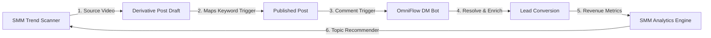
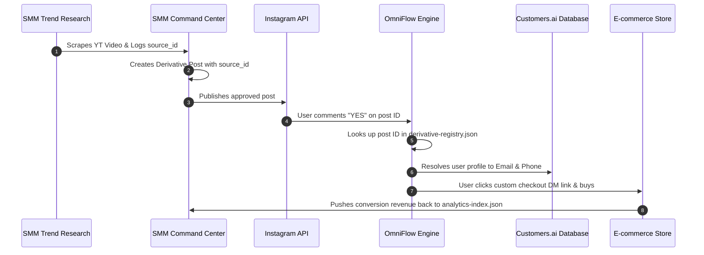

# Integration Blueprint: SMM Dashboard & OmniFlow AI (2026)

This document details how the **SMM Dashboard** (MML Trend Intelligence & Social Command Center) and **OmniFlow AI** (Omnichannel Chat Automation & Lead Enrichment) integrate. By connecting these systems, we build a closed-loop social media engine that spans from **trend discovery** to **content creation**, **DM conversion**, and **revenue attribution**.



---

## Part 1: Feature-by-Feature Integration Map

We have mapped the features of both systems to show how they work together:

### 1. Trend Research (SMM) & Identity Resolution (OmniFlow)
* **How They Work Together:** When the SMM Trend Scanner fetches a YouTube transcript and a creator writes a derivative post, that post inherits a unique `source_id` (representing the original video). When a customer comments on that post, OmniFlow captures the comment and resolves the user's identity. 
* **The Value:** We can tag the enriched lead with the original trend source (e.g., `#garyvee-2025-strategy`). This allows us to track which trend topics generate the highest quality email/phone leads.

### 2. Approval Queue & Calendar (SMM) & Flow Builder Triggers (OmniFlow)
* **How They Work Together:** When scheduling a post in the SMM Dashboard calendar, creators can select a dropdown to attach an **OmniFlow Automation Campaign** (e.g., matching the keyword `"BOOK"` to the *"MML Growth Book Flow"*).
* **The Value:** The moment the post is approved and published, the keyword trigger is automatically activated for that specific post ID, ensuring zero manual setup.

### 3. Unified Team Inbox (OmniFlow) & Content Repository (SMM)
* **How They Work Together:** When support agents handle live chat takeovers in the OmniFlow Inbox, they can access a sidebar panel containing the SMM Dashboard's approved content assets (images, PDF download links, and guides).
* **The Value:** Human agents can instantly share approved resources, documents, and promotional copy directly into DMs with a single click.

### 4. Revenue Tracker (OmniFlow) & Analytics Index (SMM)
* **How They Work Together:** When a lead converts (purchases a product via an OmniFlow automated checkout flow), OmniFlow registers the conversion and passes the revenue data back to the SMM Dashboard's `analytics-index.json`.
* **The Value:** The SMM Dashboard updates the performance score of the original derivative post, measuring **Direct Revenue per Post** instead of simple views or likes.

---

## Part 2: Integrated System Workflows

### Workflow 1: The Closed-Loop Revenue Attribution Loop
This workflow tracks a lead from initial YouTube trend discovery to final sale, providing end-to-end attribution.



1. **Discovery:** SMM Trend Intelligence scans a trending video on YouTube, assigns a `source_id` (e.g., `youtube-8a123`), and saves the transcript.
2. **Derivative Creation:** The creator writes an Instagram post based on the transcript. The SMM Dashboard registers the post in `derivative-registry.json` matching `post_id` with `source_id`.
3. **Publication & Trigger:** The post goes live. A user comments `"YES"`.
4. **Identity Resolution:** OmniFlow captures the comment, retrieves the profile name, and matches it against the Customers.ai database to enrich their email (`john@gmail.com`) and phone (`+1-555...`).
5. **Campaign Tagging:** OmniFlow queries `derivative-registry.json` for the post ID, retrieves `source_id`, and tags the lead with the trend keyword.
6. **Conversion & Loop Close:** The user buys the book. Sales revenue is pushed back to `analytics-index.json` under the original post, updating its **Topic Profitability Score**.

---

### Workflow 2: Automated Campaign Provisioning
This workflow ensures that social posts are automatically paired with the correct DM automation flows at the scheduling stage.

1. **Drafting:** A marketer drafts a post in the SMM Dashboard.
2. **Campaign Assignment:** In the scheduling panel, the creator toggles *"Attach DM Funnel"* and selects:
   * **Trigger Word:** `"GROW"`
   * **Target Flow:** *OmniFlow Lead Magnet Sequence*
3. **Queue Write:** SMM writes the metadata into `staging-candidates.json`.
4. **Deployment Sync:** Once approved, the dashboard publishes the post. SMM makes an internal API call (`POST /api/omniflow/triggers`) to provision the trigger:
   ```json
   {
     "post_id": "ig_178272562799",
     "trigger_word": "GROW",
     "flow_id": "flow_lead_magnet_v2"
   }
   ```
5. **Active Monitoring:** OmniFlow begins listening for comments containing `"GROW"` on that post ID.

---

### Workflow 3: Inbox-to-Content Feedback Loop
This workflow routes customer questions from DMs back into the content creation pipeline.

1. **Inquiry Capture:** A prospect messages the Unified Inbox asking: *"Do you have a guide on TikTok hook formulas?"*
2. **Topic Tagging:** The support agent logs this in the profile panel as a **Content Request: TikTok Hooks**.
3. **Feedback Aggregation:** The system compiles high-frequency tagging data from the inbox weekly.
4. **Queue Recommendation:** SMM parses the inbox request statistics and automatically inserts high-demand topics into `queue-recommendations.json`:
   ```json
   {
     "topic": "TikTok Hook Formulas",
     "source": "OmniFlow Inbox",
     "inbox_requests": 42,
     "priority": "High"
   }
   ```
5. **Content Scheduling:** During the next planning cycle, the SMM Dashboard prompts the creator to approve a transcript search or script draft for "TikTok Hook Formulas".
